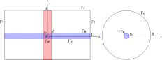

Task description
=====

Let's consider the cylindrical part of reservoir with horizontal well and transverse hydraulic fracture inside. 
The well is cylindrical pipe with radius :math:`r_w` and lenght 2L. The fracture is a circle with radius equals to 
reservoir radius. Both reservoir and fracture are saturated with fluid.

The geometry of reservoir and fracture as follows:

    - R -- reservoir radius, m;
    - L -- cylindr half height, m;
    - :math:`r_w -` well radius, m;
    - :math:`\delta -` fracture half thickness, m.

Reservoir and fluid properties:

    - k -- reservoir permeability, m2;
    - :math:`k_f -` fracture permeability, m2;
    - :math:`m_f -` fracture porosity,
    - :math:`\mu -` fluid viscosity, Pa*s. 

The domain bounds are follows: 
:math:`\Gamma_B -` side face of cylindrical reservoir, 
:math:`\Gamma_T -` bearing faces of cylindrical reservoir,
:math:`\Gamma_w -` wellbore, 
:math:`\Gamma_f -` fracture/reservoir bound,
:math:`\Gamma_w^f -` fracture/well bound.

.. note::
    Fracture permeability and porosity are constant values.

The rate of hydraulically fractured horizontal well need to be defined.